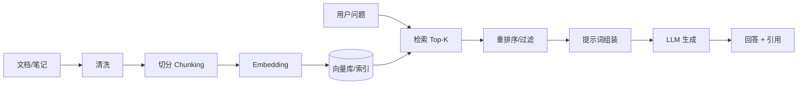

# RAG（Retrieval-Augmented Generation）

RAG（检索增强生成）是一类让[[大语言模型（LLM）]]“先检索资料、再生成回答”的系统架构：从外部知识库中检索与问题相关的内容（上下文证据），再把证据与问题一起交给模型生成答案，从而提升准确性、可更新性与可追溯性。

> [!summary] 一句话
> 把“知识”放在可更新的外部库里，用“检索”把知识临时取回来，让模型基于证据回答。

## 为什么需要 RAG

- **知识更新**：文档更新即可生效，不必重新训练模型
- **降低幻觉**：回答尽量锚定在检索到的证据上
- **可追溯/可引用**：能返回引用片段与来源（链接、文档名、段落）
- **私有数据接入**：把内部文档/个人笔记纳入问答，而不把全文塞进提示词

> [!warning] RAG 不是“保证正确”
> 若检索不到关键证据、证据质量差、或提示词与生成策略不当，依然可能答错或编造。RAG 的上限由“检索质量 + 证据组织 + 生成约束”共同决定。

## 基本流程（端到端）

### 1）离线构建（Indexing）
- **收集与清洗**：去噪、去重、统一编码、保留来源信息
- **切分（Chunking）**：把文档按段落/标题/语义切成片段（可设置重叠）
- **向量化（Embedding）**：为每个 chunk 生成向量表示（见[[Embedding]]）
- **入库**：将 `chunk文本 + 向量 + 元数据` 写入[[向量数据库]]或检索系统

### 2）在线检索与生成（Retrieval + Generation）
- **用户问题** →（可选：改写/扩展查询 Query Rewrite）
- **检索**：向量检索/关键词检索/BM25/混合检索
- **重排序（Rerank）**：用更强的模型对候选证据再排序（见[[Reranker]]）
- **组装上下文**：去重、按相关性组织、控制窗口长度
- **生成回答**：LLM 基于上下文输出，并（可选）附上引用

## 关键设计点（最容易决定效果）

### Chunking（切分）
- **太长**：召回不精确、上下文浪费、干扰生成
- **太短**：语义不完整、引用碎片化、检索结果不连贯
- 常见策略：按标题层级/段落/语义边界；保留 `h1/h2/h3` 路径作为元数据

### Retrieval（检索）
- **向量检索**：擅长语义相似，适合“问法变化大”的问题
- **关键词/BM25**：擅长精确术语、代码符号、专有名词
- **混合检索**：通常更稳（语义 + 关键词互补）

### Rerank（重排序）
- 用更强的模型对候选证据重新排序，提升“前几条证据”的质量
- 对“必须命中关键段落”的场景很重要（如制度条款、参数约束）

### Prompt（提示词组装）
- 明确要求：**只能依据证据回答**；缺证据则输出“不知道/需要更多信息”
- 控制上下文：去重、合并相邻 chunk、按来源分组
- 输出形态：回答 + 引用（文档名/链接/段落）+（可选）置信度/注意事项

> [!tip] 实用提示词要点
> - 给模型一个固定的“证据引用格式”
> - 规定“无证据时的行为”（拒答、追问、或给出需补充的字段）

## 常见失败模式（排查清单）

- **检索不到**：切分不合理、embedding 不匹配语料、查询太短/太口语
- **检索到了但答错**：上下文组织混乱、证据冲突未处理、生成未被约束
- **引用不一致**：模型在“看过证据”后仍自行发挥，需要更强约束与引用模板
- **延迟过高**：Top-K 过大、重排序模型太慢、向量库参数与缓存策略不当

## 适用场景

- 企业知识库问答、客服/工单助手
- 法律/合规/政策类问答（强调引用）
- 代码库问答与研发助手（建议混合检索）
- 个人知识库（如 Obsidian）“以笔记为准”的问答

## 相关概念（建议建立链接）

- [[Embedding]]
- [[向量数据库]]
- [[BM25]]
- [[Reranker]]
- [[Prompt Engineering]]
- [[大语言模型（LLM）]]

## 复习卡片

- RAG 的核心：**检索证据 + 证据约束生成**
- RAG 的瓶颈：通常在**检索与上下文组织**，而非“模型不会写”
- 提升手段：混合检索、重排序、改进切分、增强元数据、严格引用与拒答策略
